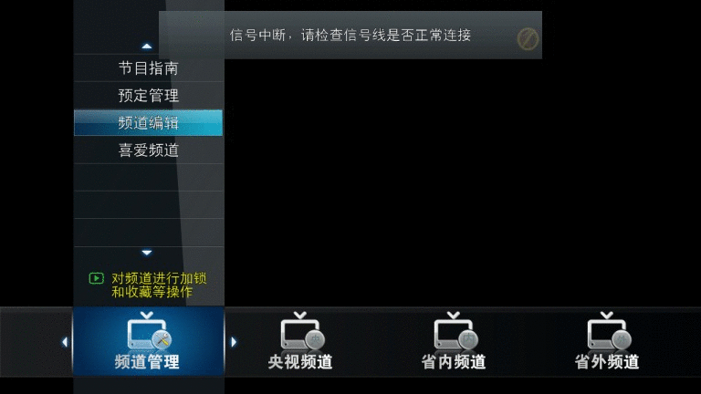

# 简易指导
#### 在linux下编译   
#请先安装依赖。本软件依赖libjpeg-dev/libpng-dev/freetype-dev/qmake等，不依赖Qt。本软件在ubuntu环境下测试通过。移植到fedora也不会有什么工作量。    
sudo apt-get install libjpeg-dev libpng-dev libfreetype6-dev    

#接着进入/path/to/GOSP/code目录，在此目录下能找到configure这个可执行文件。  
cd /path/to/GOSP/code    

sudo cp lib/Giveda.pc /usr/lib/pkgconfig/   #安装pkg-config包管理文件   
export GIVEDA_DIR=/path/to/GOSP/code        #设置环境变量  

#请确保此刻你的系统中存在qmake-qt4命令，如果你想使用qmake-qt5，请自行修改configure脚本中的qmake-qt4至qmake-qt5  
./configure    #执行configure，选择目标设备，效果如下    

make           #执行make  
#### 编译成功后，开始部署、运行   
#以你在编译时选择了Linux Desktop为例，编译成功后，进入example目录，执行runExample.sh   
cd example        #进入example目录  
./runExample.sh   #在example目录下执行runExample.sh  
使用按键进行操作（常用的按键包括：上下左右方向键（用于移动焦点）、回车用于选中、Esc用于返回和退出）  

# FAQ
#### 编译过程中常见问题的解决：   
如果提示找不到头文件或库文件，请安装依赖。本软件依赖libjpeg/libpng/freetype等。  
    sudo apt-get install libjpeg-dev libpng-dev libfreetype6-dev    

如果提示Project ERROR: Package Giveda not found，就将lib/Giveda.pc复制到/usr/lib/pkgconfig/下。  
