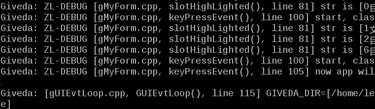

# GOSP = Giveda® Open Source Project   
中文版本： https://gitee.com/giveda/GOSP/blob/master/README.md  

# Abstract  
Qt is an excellent C++ development framework, which provides excellent APIs. I love Qt very much, but I think that Qt is too large&complex(it needs a lot RAM/ROM), so I wrote this framework, named it GOSP. On the premise of not depending on Qt, this framework provides Qt-Style APIs, and it only needs a few hundred KB of ROM&RAM.  
  **By this product(GOSP), we pay tribute to Qt's outstanding contribution to the world.**   
Here is some applications(examples):   

# 1. Description  
Qt is an excellent C++ development framework, which provides excellent APIs. I love Qt very much, but I think that Qt is too heavy(large, complex, and Qt needs a lot RAM/ROM), so I wrote this framework, named it GOSP.  
On the premise of respecting(not infringing) Qt's IPR(Intellectual Property Right), on the premise of not depending on Qt, this framework provides Qt-Style APIs, and it only needs a few hundred KB of ROM&RAM, so, GOSP is suitable for developing embedded software.  
  **2019-06-03, v1.0 was released, Codename is the Silent Blue Ghost.**    
  **I hope it can form a supplement to Qt, and wish it can be a member of Qt's ecosystem in the future.**    

Reference:  
http://blog.qt.io/cn/2018/08/15/qt_on_microcontrollers_mcu/  
http://giveda.com/

# 2. Main Features
* 100% use pictures to realize personalized GUI. (see screenshot below)   
* provides Qt-style APIs.   
* based on Giveda signal/slot technology, and there is no coupling between modules.  

# 3. Open source collaboration and License  
## 3-1 Open source collaboration model  
In this project, participants are divided into the following roles:   
*) member: Any person or entity providing resource support and/or human support for this project will be a member of this project。   
*) GP: GP is responsible for the evolution, overall objectives, organizational structure and daily affairs of the project. GP is temporarily held by the sponsor. With the development of the project, other members should be recruited as GP.   
*) ordinary participants: All participants except members and GP are ordinary participants.   

Members have the following benefits:   
*) Exemption or preference of licensing fee。   
*) Deeply participate in the development process of the project and shorten the development cycle of your own products.   
*) Talent training, community honor.   
*) Intellectual property sharing among members.    
*) The intellectual property of the project belongs to all members, and members own different proportion of property rights according to their different contributions to the project.    

## 3-2 License (For ordinary participants)  
 **This agreement is applicable to ordinary participants who are not listed in the exceptions / black list, while this agreement is not applicable to individuals and entities listed in the exceptions / black list.**  
For those personal learning purposes that do not involve any commercial purpose or commercial behavior, the user can comply with  **GNU AGPL v3.0** .  
If any commercial behavior or purpose is involved, we will adopt the following commercial license agreement to protect the legitimate rights and interests of all parties in the open source ecosystem:  
*) This program is an open-source software; and it is distributed in the hope that it will be useful, but WITHOUT ANY WARRANTY; without even the implied warranty of MERCHANTABILITY or FITNESS FOR A PARTICULAR PURPOSE.Although no quality assurance is provided, it does not mean that you can use this to infringe our goodwill; If you need quality assurance, you can buy a commercial version.As the copyright owner (hereinafter referred to as US), we have fulfilled the obligation of disclosure. Once we find that someone infringes or attempts to infringe on our goodwill, we will use administrative and legal means to fight to the end.   
*) In addition to the free use allowed by law, any use of all or part of the code needs to pay us for the license; It is prohibited to translate all or part of this software into other programming languages without permission; The distribution right cannot be obtained free of charge. It is prohibited to distribute all or part of the code of the software to others in any form (including but not limited to source form, binary form, etc.) privately or publicly without permission.   
*) Unless Both parties of the transaction agree in the license contract, otherwise, Any modification to the software, any derivative based on all or part of the code of the software, any work developed based on all or part of the code of the software, and any work that references all or part of the code of the software in any form, etc, all of the above need open source to us in time, At the same time, allow us to disclose the above software codes and/or works to the public under this same agreement, Allow us to freely use the above software codes and/or works, and allow us to authorize them to our customers for free use. Since we do not know who is using the open source software, in order to protect your rights and interests, you should negotiate and sign the license contract with us in a timely manner. It is your obligation to contact us in time to negotiate and sign the license contract.   
*)  **The business license is charged annually to the company (boss). Take the initiative to contact us and pay the market price. The reported passive payment price is punitive (10 times the market price). The reporting situation includes but is not limited to: violation of this authorization agreement, etc.**     
*)  **The informant can get a cash reward of no less than 30% of the turnover.**       
*)  **Software engineers are our most respected partners, they can get free technical support.**   
*) China's export laws and regulations apply to our distribution and remain in effect as products and technologies are re exported to other regions. We reserve the right to prohibit any user from using the this open source software.  
*) The right of interpretation belongs to us. You are fully responsible for any loss caused to us by your breach of this agreement.  
 **You can use the software only if you fully agree to the above agreement.**  
 **If you do not agree with the above agreement, do not use the software.**    

## 3-3 New Features
  **This is an open community (based on the Internet), my work is just set the ball rolling. Please join us, there are many meaningful things worth to do.**   

# 4. How to Use
Read the following easy guide document: https://gitee.com/giveda/GOSP/blob/master/HowTo.md  
Read the following HTML document: http://giveda.com/gui_engine/html/index.html    
Welcode to join in QQ group: 914464844    

# 5. Demos and Examples  

https://gitee.com/giveda/GOSP/tree/master/docs/images/DVB_768x432.gif  
https://gitee.com/giveda/GOSP/tree/master/docs/images/DVB_768x432_large.gif  
https://gitee.com/giveda/GOSP/tree/master/docs/images/DVB_edit_chnl_768x432.gif  
https://gitee.com/giveda/GOSP/tree/master/docs/images/DVB_mainMenu_768x432_png.gif  

# 6. The End  
  **This is a project in the process of planning. I just do something I am interested in when I am interested. If you think the software is useful, you can join in the open source collaboration model to support this project in the direction you expect.**   
  **contact: lei@giveda.com**   
